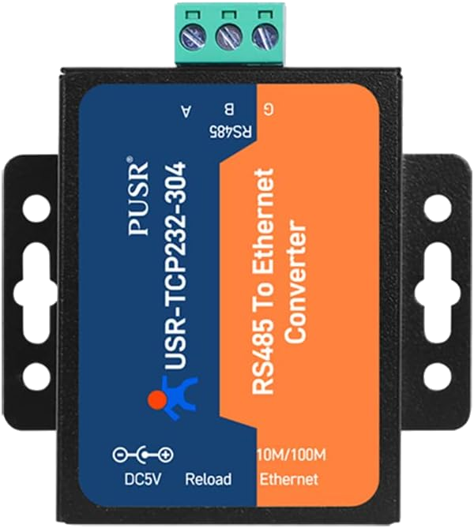
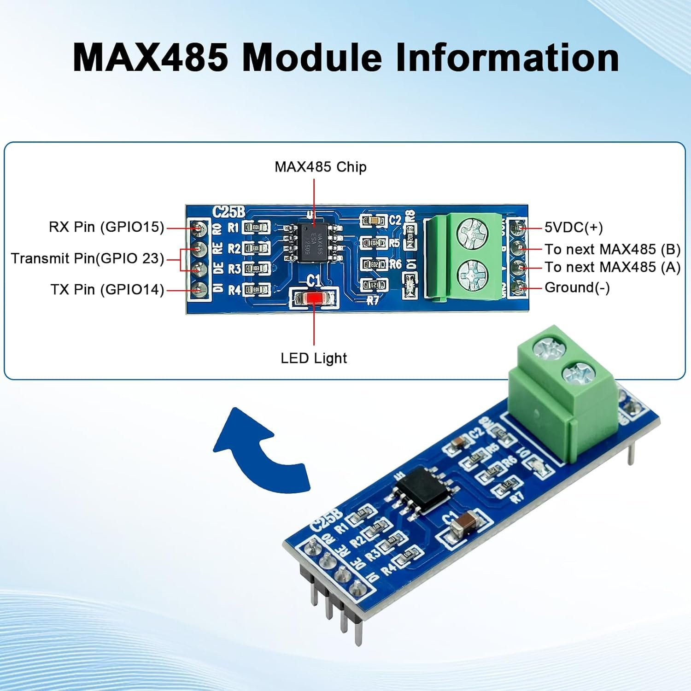

# ha-usr-modbus-bridge

<p align="center">
  
</p>

<p align="center">
  
</p>

[](https://github.com/custom-components/hacs)
[](LICENSE)
[](https://developers.home-assistant.io/docs/architecture_index/)
[](https://github.com/Elwinmage/ha-usr-modbus-bridge/releases)
[](https://paypal.me/Elwinmage)

---

Home Assistant integration for **RS-485 pool equipment** — variable-speed pool pumps (Modbus master mode) and Hayward / Silverline **inverter heat pumps** (touch-panel listener mode) — with two hardware approaches to connect them to Home Assistant.

---

## Table of contents

- [Supported devices](#supported-devices)
- [Two ways to connect](#two-ways-to-connect)
  - [Option A — USR TCP bridge](#option-a--usr-tcp-bridge-recommended-for-most-users)
  - [Option B — ESP32 + MAX485](#option-b--esp32--max485-esphome)
  - [Comparison](#comparison)
- [InverFlow Eco — Modbus register map](#inverflow-eco--modbus-register-map)
- [Hayward pool heat pump](#hayward-pool-heat-pump)
- [HA integration setup (Option A)](#ha-integration-setup-option-a)
- [ESPHome setup (Option B)](#esphome-setup-option-b)
- [Entities](#entities)
- [Resilience & wake-up mechanism](#resilience--wake-up-mechanism)
- [Adding new devices](#adding-new-devices)
- [Troubleshooting](#troubleshooting)
- [Related projects](#related-projects)

---

## Supported devices

| Device | Manufacturer | Protocol | Baud | Address | Mode | Status |
|--------|-------------|----------|------|---------|------|--------|
| InverFlow Eco | Madimack / Aquagem | Modbus RTU 8N1 | 9600 | 0xAA (170) | Polled (we are master) | ✅ Fully supported |
| Pool heat pump | Hayward / Silverline | Touch-panel RTU 8N1 | 9600 | 0x02 (fixed) | Listener (pump is master) | ✅ Sensors + `climate` |

> The InverFlow Eco is an OEM version of the Aquagem InverPro pool pump. All variants sharing the same controller (Madimack, Aquagem, Fairland INVERX, etc.) should be compatible.
>
> The **Hayward pool heat pump** support targets recent Hayward / Silverline inverter units whose Wi-Fi dongle speaks the Modbus-framed *touch-panel* protocol. On this bus **the pump is the master** and the integration emulates the Wi-Fi module (address `0x02`), so it runs a persistent *listener* instead of polling. It exposes a full **`climate`** entity (on/off, heat/cool/auto, setpoint) plus temperature / current / fan sensors. It is **not** for the older single-wire PC1000/PC1001 controllers.

---

## Two ways to connect

Both options give you the same Home Assistant entities and the same local, cloud-free control. The difference is in the hardware between your pump and Home Assistant.

### Option A — USR TCP bridge *(recommended for most users)*

A **USR-TCP232-304** (or compatible) converter sits on the RS-485 bus and bridges it to your home network over TCP. The HA integration connects to it directly — no additional hardware required beyond the converter.

```
Home Assistant
     │
     │ TCP  (LAN)
     ▼
USR-TCP232-304
192.168.0.x:8899
9600 baud / 8N1
     │
     │ RS-485
     ▼
InverFlow Eco
addr 170 (0xAA)
```

**Pros:** simple setup, no firmware to maintain, one device for multiple pumps on the same bus.
**Cons:** requires a separate Ethernet/WiFi device on the network.

---

### Option B — ESP32 + MAX485 *(ESPHome)*

An **ESP32** with a cheap **MAX485 TTL module** connects directly to the pump RS-485 bus over GPIO. ESPHome handles the Modbus protocol and exposes entities to Home Assistant via the native API.

```
Home Assistant
     │
     │ ESPHome native API  (WiFi)
     ▼
ESP32 + MAX485 module
GPIO14=TX  GPIO15=RX  GPIO23=DE/RE
     │
     │ RS-485
     ▼
InverFlow Eco
addr 170 (0xAA)
```

**Pros:** ~5€ total hardware cost, no extra device on the network, fully local.
**Cons:** one ESP32 per RS-485 bus segment, requires flashing ESPHome firmware.

> The ESP32 wiring below is for the **InverFlow** pump. For the **Hayward heat pump** on an ESP32, use the dedicated repo [ha-esphome-hayward](https://github.com/Elwinmage/ha-esphome-hayward) (auto-direction transceiver, `climate` entity included).

---

### Comparison

| | Option A — USR TCP bridge | Option B — ESP32 + MAX485 |
|---|---|---|
| **Hardware cost** | ~25-40€ | ~5-10€ |
| **Setup complexity** | Low — web UI config | Medium — ESPHome flash |
| **Multiple devices on same bus** | ✅ Yes | ⚠️ One bus per ESP32 |
| **Firmware to maintain** | ❌ None | ✅ ESPHome OTA |
| **HA integration** | Custom component (this repo) | ESPHome native API |
| **Network dependency** | TCP over LAN | WiFi |
| **Wake-up mechanism** | Automatic (coordinator) | Boot + 5min interval + button |

---

## InverFlow Eco — Modbus register map

> Confirmed by RS-485 capture session and Tuya/Modbus correlation (2026-05-08).

### Read registers (FC=03, device address 0xAA / 170)

| Register (hex) | Register (dec) | Key | Description | Notes |
|----------------|----------------|-----|-------------|-------|
| 0x07D1 | 2001 | `error_code` | Error bitmask | 0=no error — also the **wake-up register** |
| 0x07D2 | 2002 | `op_condition` | Operation condition bitmask | bit0=1 → running |
| 0x07D3 | 2003 | `speed_pct` | Running capacity % | Actual speed, not setpoint |
| 0x07D4 | 2004 | `power_w` | Instant power W | Confirmed vs Tuya DPS 5 |
| 0x07D7 | 2007 | `const_2007` | Firmware constant (~88) | Fixed value, meaning unknown |
| 0x07D8 | 2008 | `const_2008` | Firmware constant (~20) | Fixed value, meaning unknown |
| 0x07D9 | 2009 | `const_2009` | Firmware constant (~28) | Fixed value, meaning unknown |

### Write register (FC=06)

| Register (hex) | Register (dec) | Description | Range |
|----------------|----------------|-------------|-------|
| 0x0BB9 | 3001 | Speed setpoint % | 0=stop, 30–100=run |

> Speed is snapped to the nearest 5% and clamped to 30% minimum when running.

### Error bitmask (register 2001)

| Bit | Error |
|-----|-------|
| 0 | DC voltage abnormal |
| 1 | AC current sampling circuit failure |
| 2 | Phase-deficient protection |
| 3 | Master drive error |
| 4 | Heatsink sensor error |
| 5 | Heatsink overheat |
| 6 | Output current exceeds limit |
| 7 | Input voltage abnormal |
| 8 | No water protection |
| 9 | Panel↔master comm failure |
| 10 | Panel EEPROM read error |
| 11 | RTC read error |
| 12 | Main EEPROM read error |
| 13 | Motor current detection error |
| 14 | Motor power overload |
| 15 | PFC protection |

### ON/OFF strategy

The InverFlow Eco has **no dedicated ON/OFF Modbus register**:

- `turn_off` → write **0** to register 0x0BB9
- `turn_on` → write **last known speed** (default 80%) to register 0x0BB9

Running state is determined by reading `op_condition` bit 0.

### Wake-up behaviour

After a power cut or extended RS-485 silence, the pump stops responding. A single FC=03 read on register **0x07D1** re-activates the RS-485 interface. Both solutions implement this automatically.

---

## Hayward pool heat pump

Unlike the InverFlow (which the integration *polls* as a Modbus slave), the
Hayward heat-pump control board is itself the **master**: it broadcasts its
sensor block and polls each peripheral. The integration therefore emulates the
**Wi-Fi module** on the bus:

- it keeps a persistent connection to the USR gateway and answers the board's
  status polls with the correct device identity (`reg 3009 = 0x0102`) and a
  small reply hold-off (~60 ms, like the real touch panel);
- it mirrors the pump's settings and, to apply a change, raises a flag, serves
  the edited settings block when the board reads it back, then the board
  commits.

### Connection (USR gateway)

Same USR-TCP232 wiring and web-UI settings as the InverFlow (TCP Server, 9600
8N1, RFC2217 **off**). Wire the pump's RS-485 **A/B/GND** to the USR `A+/B-/GND`.

### Setup in Home Assistant

**Settings → Devices & Services → Add Integration → USR Modbus Bridge**

1. **Gateway** step: IP / port / 9600 / 8N1 (as for any device).
2. **Device type** step: choose **Hayward pool heat pump**, give it a name.
   The Modbus **address is fixed to `0x02`** and is *not* asked (it is structural
   for the Wi-Fi slot).
3. Done. Within a few seconds the settings blocks are pulled (auto-refresh) and
   the **climate** entity + sensors become available.

**Options (post-setup):** click **Configure** to tune the **reply hold-off**
(ms) if a command is ever not picked up (50–90 ms is the useful range).

### Hayward entities

| Entity | Type | Description |
|--------|------|-------------|
| Heat pump | `climate` | on/off, heat / cool / auto, target temperature, current temp (water inlet), heating/cooling action |
| Water inlet / outlet | Sensor | Loop temperatures |
| Suction / Coil / Ambient / Exhaust | Sensor | Circuit temperatures |
| Compressor current | Sensor | A |
| AC voltage | Sensor | V |
| Fan speed | Sensor | rpm |
| Per-mode setpoint memory (cool/heat/auto) | Sensor (diag) | Memorised setpoints from block 1091 |

### ESP32 alternative for the heat pump

Prefer a direct ESP32 on the bus instead of a USR gateway? A dedicated ESPHome
external component provides the same `climate` entity + sensors, standalone:
**[ha-esphome-hayward](https://github.com/Elwinmage/ha-esphome-hayward)**. Use
an **auto-direction** RS-485 transceiver (e.g. MAX13487E) — no DE pin needed.

---

## HA integration setup (Option A)

### USR converter configuration

| Parameter | Value |
|-----------|-------|
| Work Mode | **TCP Server** |
| Local Port | 8899 |
| Baud Rate | 9600 |
| Data Size | 8 bit |
| Parity | None |
| Stop Bits | 1 |
| **Similar RFC2217** | **❌ OFF** (critical — TX stays 0 if enabled) |
| **TCP Server-kick off old connection** | **❌ OFF** |
| Modbus Type | None |

### Wiring

| InverFlow connector | USR terminal |
|---------------------|-------------|
| PIN 6 (RS485 A / DATA+) | A+ |
| PIN 7 (RS485 B / DATA−) | B− |
| PIN 5 (GND) | GND (optional) |

### Installation

#### HACS (recommended)
1. HACS → Integrations → ⋮ → Custom repositories
2. Add `https://github.com/Elwinmage/ha-usr-modbus-bridge` as **Integration**
3. Install **USR Modbus Bridge** → Restart HA

#### Manual
Copy `custom_components/usr_modbus_bridge/` into your HA `custom_components/` folder and restart.

### Configuration

**Settings → Devices & Services → Add Integration → USR Modbus Bridge**

**Step 1 — Gateway**

| Field | Description |
|-------|-------------|
| Gateway model | USR-TCP232-304 / USR-TCP232-306 / USR-N510 / Other |
| IP address | IP of the USR converter |
| TCP port | Default: 8899 |
| Baud rate | 9600 |
| Data bits / Parity / Stop bits | 8 / None / 1 |

**Step 2 — Device**

| Field | Description |
|-------|-------------|
| Device type | InverFlow Eco |
| Modbus address | **170** (shown in pump menu) |
| Friendly name | e.g. "Pool pump" |
| Poll interval | 2–300 s (default 10 s) |

**Options (post-setup):** click **Configure** to change baud rate, bus parameters, or poll interval without re-adding the integration.

---

## ESPHome setup (Option B)

### Hardware

<p align="center">
  
</p>

| Component | Notes |
|-----------|-------|
| ESP32 dev board | Any ESP32 board |
| MAX485 module | C25B or equivalent (~2€) |

### Wiring

```
ESP32 GPIO14 (TX) ──→ MAX485 DI
ESP32 GPIO15 (RX) ←── MAX485 RO
ESP32 GPIO23      ──→ MAX485 RE  ┐ tie together
ESP32 GPIO23      ──→ MAX485 DE  ┘
MAX485 VCC        ←── 5V
MAX485 GND        ──── GND
MAX485 A (DATA+)  ──── InverFlow PIN 6
MAX485 B (DATA−)  ──── InverFlow PIN 7
```

> RE and DE are tied together on the module — GPIO23 HIGH = transmit, LOW = receive.

### Configuration

Full YAML: [`doc/inverflow_esphome.yaml`](doc/inverflow_esphome.yaml)

```bash
# Flash
esphome run doc/inverflow_esphome.yaml
```

---

## Entities

Both options expose equivalent entities:

| Entity | Type | Description |
|--------|------|-------------|
| Power | Switch | ON (restores last speed) / OFF (setpoint=0) |
| Speed | Sensor | Actual running speed % |
| Power | Sensor | Instant power consumption W |
| Speed setpoint | Number | Target speed slider |
| Restart / Wake-up | Button | Force reconnect + RS-485 wake-up |
| Error | Text sensor (diag) | Decoded error bitmask from reg 2001 |
| Firmware constants | Sensors (diag) | Raw firmware constants, hidden by default |

---

## Resilience & wake-up mechanism

| Situation | Option A (HA integration) | Option B (ESPHome) |
|-----------|--------------------------|-------------------|
| Pump asleep after power cut | Wake-up ping at startup + after every reconnect | Wake-up ping at boot |
| All registers ERR × 3 polls | Auto TCP reconnect + wake-up | ESPHome Modbus retry |
| No valid data for 5 min | Auto TCP reconnect + wake-up | Periodic wake-up every 5 min |
| Manual recovery | **Restart connection** button | **Wake-up RS485** button |

> ⚠️ Only **one TCP client** can connect to the USR converter at a time. Never run diagnostic scripts (socat, Python monitor) while the HA integration is active.

---

## Adding new devices

1. Create `custom_components/usr_modbus_bridge/bridge/devices/mydevice.py`
2. Subclass `ModbusDevice` from `bridge/devices/base.py`
3. Declare `READ_REGISTERS`, implement `set_speed()`, set `WAKE_UP_REGISTER` if needed
4. Register in `const.py → DEVICE_PROFILES`

```python
from .base import ModbusDevice, RegisterDef

class MyDevice(ModbusDevice):
    DEVICE_KEY       = "my_device"
    DEVICE_NAME      = "My Pool Pump"
    MODBUS_ADDRESS   = 0x01
    WAKE_UP_REGISTER = 0x0001  # optional

    READ_REGISTERS = [
        RegisterDef(0x0001, "speed", "Speed", "%", 1, 0),
        RegisterDef(0x0002, "power", "Power", "W", 1, 0),
    ]

    async def set_speed(self, client, speed_pct: int) -> bool:
        return await client.write_register(self.MODBUS_ADDRESS, 0x0010, speed_pct)

    @property
    def sensor_keys(self): return ["speed", "power"]

    @property
    def switch_key(self): return "speed"
```

---

## Troubleshooting

**Pump does not respond after power cut**
→ Press **Restart connection** (Option A) or **Wake-up RS485** (Option B). The wake-up ping re-activates the RS-485 interface.

**TX counter stays at 0 on USR web interface**
→ Disable **Similar RFC2217** in the USR web UI → Save → power cycle the USR physically.

**All entities show unavailable**
→ Verify no other client (socat, Python script) is connected to port 8899. Check HA logs for connection errors.

**Integration does not find the device during setup**
→ Confirm Modbus address in pump menu (InverFlow Eco default: **170**). Ensure pump is powered and PIN6/PIN7 wired correctly.

**ESPHome: pump not responding after ESP32 reboot**
→ The boot wake-up ping handles this automatically. If it persists, press the **Wake-up RS485** button in HA.

---

## Related projects

- [ha-usr-r16-component](https://github.com/Elwinmage/ha-usr-r16-component) — USR-R16 relay controller integration
- [ESPHome InverFlow community config](https://forums.whirlpool.net.au/archive/3kpyw2n7) — original ESPHome YAML inspiration

---

## License

MIT
